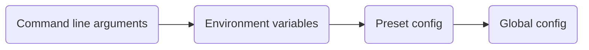

# Randomizer Anywhere

**Randomizer Anywhere** is a successor to [Randomizer TMF](https://github.com/BigBang1112/randomizer-tmf) that brings the Random Map Challenge experience to every TrackMania game (that supports GBXRemote protocol) by spinning up a fully configured dedicated server for you.

Instead of hooking into your local game client, Randomizer Anywhere downloads, configures, and launches a dedicated server, then drives the whole randomizer experience through a few in-game chat commands. This means it works for every player connected to the server, solo or with friends, on your machine or over the network. And on Linux, too!

This project was made to support the [100% TMX Project](https://discord.gg/HRShWnzpK3).

> **This is a modified fork** of [BigBang1112/randomizer-anywhere](https://github.com/BigBang1112/randomizer-anywhere), licensed under [AGPLv3](LICENSE). On top of the original tool, this fork adds a leaderboard, impossible/hard map reporting with Discord alerts, curated genre presets with player voting, TMX-valid replay delivery over HTTP, a live status page, clickable in-game manialink widgets, Rounds-mode support for multilap maps, Linux dedicated server support, and other features for the 100% TMX Project. Source of this fork: https://github.com/cheatoskar/randomizer-anywhere-100--tmx

## Supported games

| Game | Dedicated server |
| --- | --- |
| TrackMania Nations Forever (TMNF) | TMF |
| TrackMania United Forever (TMUF) | TMF |
| TrackMania Nations ESWC (TMN) | TM |
| TrackMania Sunrise eXtreme (TMS) | TM |
| TrackMania Original (TMO) | TM |

## Features

- Automatically downloads, configures, and starts the correct dedicated server for your chosen game
- Random map picking powered by [TMX](https://tm-exchange.com/) (tmnf.exchange, tmuf.exchange, nations/sunrise/original tm-exchange.com)
- All TMX randomization filters supported
- Ingame chat commands to control the session without leaving the game
- Configurable session time limit that freezes/resumes correctly across map loads (or none at all - unlimited time until skip/finish)
- Auto skip on Author/Gold/Silver/Bronze medal, or on finish, once a session is active
- Works solo on LAN, or with multiple players on LAN or the Internet (uses server vote-calling for skip/next map)
- Delivers a TMX-valid replay download link after every finish (TMX only accepts server-saved replays, not a client's own "save replay" button)
- Permanent impossible-map exclusion, refreshed periodically from a shared list, plus in-session `/imp` and `/hard` reporting with Discord webhook alerts
- Persistent server-side leaderboard (`/top`, `/rank`)
- Curated genre presets, switchable instantly by an admin or via player vote (`/preset`, `/votepreset`)
- `/rounds` switches a genuinely multilap map to Rounds mode on demand, so a full-length finish produces a valid replay, then reverts to TimeAttack automatically on the next map
- Clickable in-game manialink widgets: preset picker, Yes/No vote popup, a Rounds-mode prompt on multilap maps, and a live map-info panel (difficulty, TMX award count, author time)
- Live auto-refreshing status webpage (current map + TMX preview image, active preset, who's racing and on which checkpoint, top finishers)
- Clean shutdown on `systemctl stop`/`SIGTERM` - no orphaned dedicated server process, no crash dump

## Installation

Randomizer Anywhere is a .NET console app. It is still WIP upstream, so no builds are distributed yet - this fork runs from source (that's exactly how the live 100% TMX Project server on Linux is deployed).

1. Install the [.NET SDK](https://dotnet.microsoft.com/download) matching the version required by the project.
2. Clone this repository.
3. Copy `RandomizerAnywhere/config.default.toml` to `RandomizerAnywhere/config.toml` (or the app's output directory) and adjust it - see [Configuration](#configuration-configtoml) below.
4. Run the app from the `RandomizerAnywhere` project folder:

```
dotnet run --project RandomizerAnywhere
```

Once ready, the server becomes available in your game's "Local network" menu (or on the public internet, once `Lan = false` and `PublicHost` are set).

## Presets

Presets bundle a reusable set of options into a named `.toml` file, handy for sharing curated challenge packs without editing `config.toml` directly.

You can set `Preset = "<name>"` in `config.toml` to activate a certain preset at the start of the app. Players can list and vote for any of them in-game with `/presets` and `/votepreset <name>` (or the clickable preset widget); an admin login can switch instantly with `/preset <name>`.

The following presets are bundled:

| Preset | Display name | Key features |
| --- | --- | --- |
| `100tmx_tmnf` | 100% TMX Project (TMNF) | Unfinished maps, auto-skip on finish - the default |
| `short_lol_tmnf` | Short & LOL | LOL/Stunt-tagged maps, short author time cap |
| `lunatic_tmnf` | Lunatic | Lunatic-difficulty maps |
| `rpg_tmnf` | RPG Together | RPG/Trial-tagged maps, Unlimiter blocks allowed |
| `fullspeed_tmnf` | Fullspeed | Fullspeed-tagged maps |
| `tech_tmnf` | Tech | Tech/SpeedTech-tagged maps |
| `impossible_review_tmnf` | Impossible Review | Admin-only: cycles only through maps flagged via `/imp`, for manual review - no auto-skip |

To create a new preset, add a `<name>.toml` file to the `Presets` folder (see `Presets/100tmx_tmnf.toml` for an example). TMX genre filters use the `tag` query parameter (the `Tags` array on a track, e.g. `tag = "6,1"` for LOL or Stunt) - not `primarytype`, which 404s on `/trackrandom` for any nonzero value despite being a documented field. See the comments in any bundled preset for the full list of known-good tag/difficulty values.

## Command line usage

```
RandomizerAnywhere [--game <game>] [--tmx-game <game>] [--tmx-query <query>] [--bind-ip <ip>] [--xmlrpc-port <port>] [--server-name <name>] [--no-server] [--help]
```

| Option | Description |
| --- | --- |
| `--game`, `-g <game>` | Game to set up: `TMNF`, `TMUF`, `TMN`, `TMS`, or `TMO`. Falls back to `Game` in `config.toml`, then prompts interactively if not set. |
| `--tmx-game`, `-t <game>` | TMX site to use, if different from `--game`: `TMNF`, `TMUF`, `TMN`, `TMS`, or `TMO`. |
| `--tmx-query`, `-q <query>` | Raw TMX query string to filter randomized maps, overriding the `TmxQuery` table in `config.toml`, as well as any modification later in the setup. |
| `--bind-ip <ip>` | IP address the dedicated server binds to. |
| `--xmlrpc-port <port>` | Port used for the GBXRemote XML-RPC connection to the dedicated server. |
| `--server-name <name>` | Name shown for the server in the game's server list. |
| `--no-server` | Skip downloading/starting the dedicated server (useful if you already have one running). |
| `--help`, `-h` | Show usage information. |

## Environment variables

Many settings can also be provided through an environment variable, which is useful for containerized or headless setups. Environment variables take priority over `config.toml` but are overridden by command line arguments where an equivalent option exists.

| Variable | Description |
| --- | --- |
| `RANDANY_GAME` | Game to set up: `TMNF`, `TMUF`, `TMN`, `TMS`, or `TMO`. |
| `RANDANY_BIND_IP` | IP address the dedicated server binds to. |
| `RANDANY_XMLRPC_PORT` | Port used for the GBXRemote XML-RPC connection to the dedicated server. |
| `RANDANY_AUTO_SKIP_MODE` | Auto skip trigger: `AuthorMedal`, `GoldMedal`, `SilverMedal`, `BronzeMedal`, `Finished`, or `None`. |
| `RANDANY_NO_SERVER` | Set to `true` to skip downloading/starting the dedicated server. |
| `RANDANY_CALLVOTE_ON_FINISH` | Set to `true` to call a vote to skip/next map once someone finishes, instead of an instant skip. |
| `RANDANY_SERVER_NAME` | Name shown for the server in the game's server list. |
| `RANDANY_GAMESETTINGS` | Path to the match settings file used to configure the dedicated server. |
| `RANDANY_LAN` | Set to `true` for LAN-only discovery (no masterserver registration) - useful for local testing. |

## Configuration precedence

Settings can come from multiple sources. When the same setting is provided in more than one place, the following order decides which value wins, from highest to lowest priority:



The final configuration state is then written into session data for leaderboard filters.

## Configuration (`config.toml`)

Beyond the game/server basics, `config.toml` (see `config.default.toml` for the full annotated template) controls this fork's own features:

| Field | Description |
| --- | --- |
| `TimeLimit` | Session time budget in milliseconds. `0` means unlimited - the session only ever advances on finish or `/skip`, never on a timer. |
| `AdminLogins` | Comma-separated TMF logins allowed to use `/stop`, `/end`, `/start`, and `/preset` directly, no vote needed. Leave empty to let everyone use them. `/presets` (listing) and `/votepreset` are always open to everyone. |
| `ReplayServerPort` | Port for the built-in HTTP server that hands players their TMX-valid replay download link and serves the live status page. Needs to be open in your firewall. |
| `PublicHost` | Public hostname/IP used to build replay links and the status page URL. Leave empty for local testing (falls back to `localhost`) - **must** be set to your real public IP/domain for an internet-facing deployment. |
| `Lan` | `true` for LAN-only discovery, `false` to register with the real masterserver. Must be `false` for a real internet-facing deployment. |
| `DiscordWebhookUrl` / `DiscordWebhookUrlHard` | Discord webhook URLs for `/imp` and `/hard` reports. Leave `DiscordWebhookUrlHard` empty to send both to the same channel as `DiscordWebhookUrl`. Leave both empty to disable Discord alerts entirely. |
| `ServerComment` | Shown in the game's server browser. |
| `WelcomeMessage` | Multi-line chat message sent to everyone on connect. |
| `SourceFromImpossibleList` (preset-only) | When `true` on a preset, that preset cycles only through maps already flagged impossible, instead of querying TMX - used by the bundled `impossible_review_tmnf` preset. |

## In-game chat commands

| Command | Description |
| --- | --- |
| `/start` | Starts a new randomizer session and queues the first random challenge. |
| `/stop`, `/end` | Stops the active session and resets the current challenge. |
| `/skip` | Skips the current challenge for a new random one. |
| `/imp` | Marks the current challenge as impossible so it won't appear again, and reports it to Discord for review. |
| `/hard` | Flags the current challenge as hard for review, without excluding it. Reports to Discord. |
| `/rounds` | Switches the current map to Rounds mode if it's a genuine multilap challenge, so a full finish produces a TMX-valid replay. Reverts to TimeAttack automatically once the map ends. |
| `/top` | Shows the top finishers on this server. |
| `/rank` | Shows your own rank and finish count. |
| `/map` | Shows the current map's TMX link. |
| `/timelimit`, `/tl <seconds>` | Shows or sets the session time limit (only while no session is active). |
| `/preset <name>` | Applies a bundled preset by name directly (admin only if `AdminLogins` is set; only while no session is active). |
| `/presets` | Lists all available presets, and opens a clickable widget to vote for one. |
| `/votepreset <name>` | Starts a vote to switch preset; other players support it with `/yes` (or the Yes/No widget) within the vote window. |
| `/yes`, `/no` | Supports or withdraws support from an active preset vote. |
| `/commands` | Lists every raw command name. |
| `/info` | Shows a summary of what the server can do. |
| `/source` | Links to the source code of this modified server (AGPLv3 compliance). |
| `/testhud` | Diagnostic: displays a test manialink to confirm HUD widgets are rendering for your client. |

## Live status page

The built-in HTTP server (see `ReplayServerPort`) also serves an auto-refreshing status page at `/` - the current map with its TMX preview image, the active preset, everyone currently racing and their live checkpoint progress, and the top finishers list. `/status.json` exposes the same data as JSON.

## Special thanks

- To [BigBang1112](https://github.com/BigBang1112), for building Randomizer Anywhere and Randomizer TMF before it
- To Flink and Greep, for inventing the challenge
- To the TMX maintainers that make this possible!
